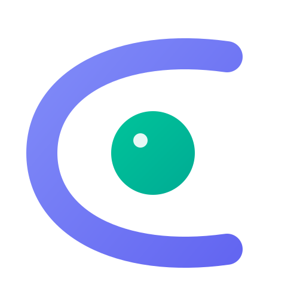

<p align="center">
  
</p>

<h1 align="center">CLAI</h1>

<p align="center">
  <a href="https://opensource.org/licenses/MIT"></a>
  <a href="https://github.com/juacker/clai/releases"></a>
  <a href="https://github.com/juacker/clai/actions/workflows/ci.yml"></a>
</p>

<p align="center">
  A desktop multi-agent orchestration and monitoring app with MCP-native tools, shared workspaces, and scheduled automations.
</p>

## Features

- **MCP-Native Assistant** - Attach MCP servers to a tab and the assistant can use their tools directly. Tabs scope capability access explicitly.

- **Scheduled Automations** - Create enabled/disabled automations that run on a schedule using your configured AI provider and selected MCP servers.

- **Monitoring Workflows** - The assistant can inspect metrics, anomalies, alerts, and logs through attached MCP servers, then turn findings into workspace artifacts.

- **Workspace Orchestration** - The assistant can open anomalies panels, split tiles, add canvas nodes, and create dashboard charts as part of a workflow.

- **Canvas and Dashboards** - Automations and chat sessions can create visual artifacts directly in the workspace with explicit targets.

- **Tabbed Capability Scopes** - Normal tabs start with no MCP access until you attach servers. Automation tabs inherit the MCP allowlist from the automation config.

- **Provider Flexibility** - Run with OpenCode, Claude Code, Gemini CLI, or Codex as the AI backend.

## Installation

Download the latest release for your platform from the [Releases page](https://github.com/juacker/clai/releases):

| Platform | Download |
|----------|----------|
| Windows | `.msi` or `.exe` |
| macOS | `.dmg` |
| Linux | `.deb`, `.rpm`, or `.flatpak` |

## Getting Started

1. **Install an AI provider CLI** - OpenCode, Claude Code, Gemini CLI, or Codex
2. **Configure your provider** - Set the provider in CLAI settings
3. **Add MCP servers** - Register local or remote MCP servers in Settings
4. **Attach MCP servers to a tab** - Use the `Add MCP` badge in the tab context bar
5. **Start orchestrating** - Ask the assistant to inspect tools, fetch data, open panels, or build visualizations
6. **Create scheduled automations** - Enable automations that run periodically with their own MCP allowlist

## MCP Model

CLAI is built around explicit capability scoping:

- **Global MCP server config** lives in Settings
- **Normal tabs** only get access to MCP servers you attach explicitly
- **Scheduled automations** use the MCP servers selected in their automation config
- **Built-in tools** focus on workspace orchestration like tabs, canvas, dashboard, and anomalies panels
- **Domain tools** should come from MCP servers whenever possible

## AI Provider Setup

To run assistant automations, install one of these CLI tools:

- **[OpenCode](https://opencode.ai)** - `opencode` CLI
- **[Claude Code](https://claude.ai/code)** - `claude` CLI
- **[Gemini CLI](https://github.com/google-gemini/gemini-cli)** - `gemini` CLI
- **[Codex](https://github.com/openai/codex)** - `codex` CLI

Configure the provider in the app settings, then create or enable scheduled automations as needed.

## Netdata Integration

Netdata is now treated as an integration, not the default product model.

- Use a Netdata MCP server when you want the assistant to discover spaces, rooms, nodes, metrics, and related tools
- `dashboard.addChart`, `canvas.addChart`, and `anomalies.open` are exposed only when a Netdata-capable MCP server is available for the session
- Chart and anomalies flows use explicit `spaceId` / `roomId` targets instead of hidden tab context

## Development

```bash
# Clone and install
git clone https://github.com/juacker/clai.git
cd clai
npm install

# Run the desktop app in development
make dev

# Verify frontend and Rust builds
npm run build
cargo check --manifest-path src-tauri/Cargo.toml
```

## Current Architecture

- **Frontend**: React + Tauri
- **Workspace runtime**: tabs, split tiles, canvas, dashboards, anomalies panels
- **Assistant runtime**: session-scoped built-ins plus selected MCP tools
- **Automation runtime**: one scheduled instance per enabled automation
- **MCP support**: per-server config, optional bearer auth, HTTP and stdio clients

The product direction is a general multi-agent orchestration and monitoring app rather than a Netdata-specific desktop app.

## License

MIT
